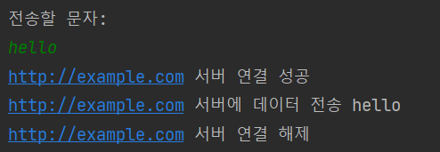

# 📌예외 처리를 위한 실습 준비
기초적인 구성을 만든 후 여러 단계에 거쳐 코드를 발전시켜 나간다.

## 🗺️실습 과정에 대한 구성도

* Main
  * 사용자 입력을 받는 시작점
* NetworkService
    * NetworkClient의 주요 기능을 쉽게 사용할 수 있도록 만든 **인터페이스**라고 생각하면 된다.
* NetworkClient
    * 실질적으로 모든 **주요 기능**(서버와 연결, 데이터 전송, 연결 해제)을 담당한다.

## 📝코드
### Main
```java
public class mainV0 {

  public static void main(String[] args) {
    NetworkServiceV0 networkService = new NetworkServiceV0();
    Scanner scanner = new Scanner(System.in);
    while (true) {
      System.out.println("전송할 문자: ");
      String input = scanner.nextLine();
      if (input.equals("exit")) {
        break;
      }
      networkService.sendMessage(input);
      System.out.println();
    }
    System.out.println("프로그램을 정상 종료합니다.");
  }
}
```

### NetworkService
```java
public class NetworkServiceV0 {
    
    public void sendMessage(String data) {
        String address = "http://example.com";
        NetworkClientV0 networkClient = new NetworkClientV0(address);

        // NetworkClient 주요 기능들을 호출한다.
        networkClient.connect();
        networkClient.send(data);
        networkClient.disconnect();
    }
}
```

### NetworkClient
```java
public class NetworkClientV0 {

    // 연결할 서버의 네트워크 주소
    private final String address;

    public NetworkClientV0(String address) {
        this.address = address;
    }

    public String connect() {
        // 서버 연결 성공
        System.out.println(address + " 서버 연결 성공");
        return "Success";
    }

    public String send(String data) {
        // 데이터 전송 성공
        System.out.println(address + " 서버에 데이터 전송 " + data);
        return "Successs";
    }

    public void disconnect() {
        System.out.println(address + " 서버 연결 해제");
    }
}
```

## 🚀동작 결과
